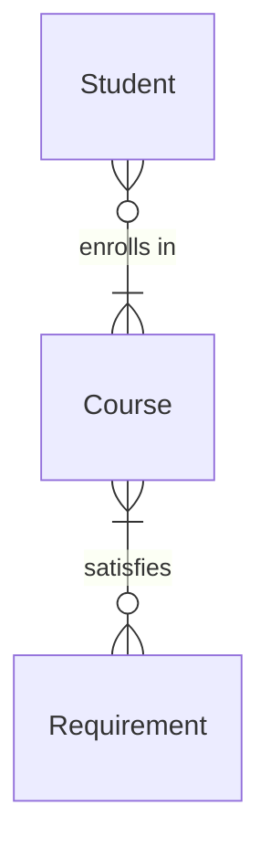

# [your.harvard](https://cs50.harvard.edu/sql/2024/psets/5/your.harvard/)


Le logo my.harvard

## Problème à Résoudre

Si vous n'êtes pas déjà familier, Harvard dispose d'un outil de recherche de cours appelé my.harvard, avec lequel les étudiants explorent (et finalement s'inscrivent !) aux cours. Pour suivre les cours, les étudiants et leurs inscriptions, my.harvard utilise probablement une sorte de base de données sous-jacente. Et pourtant, si vous l'avez déjà utilisé, vous savez que my.harvard n'est pas particulièrement... rapide.

Voici votre chance de rendre my.harvard un peu plus rapide ! Dans ce problème, prenez des données de cours de Harvard et créez des index pour accélérer les requêtes typiques sur la base de données. Gardez à l'esprit que l'indexation de chaque colonne n'est pas toujours la meilleure solution : vous devrez considérer les compromis en termes d'espace et de temps, représentant finalement les cours et les étudiants de Harvard de la manière la plus efficace possible.

## Démonstration

```sql
$ sqlite3 harvard.db                                                                                
sqlite> SELECT "title", "semester"                                                                  
   ...> FROM "courses"                                                                              
   ...> WHERE "semester" = 'Fall 2023'                                                              
   ...> LIMIT 5;   
```

## Code de Distribution

Pour ce problème, vous devrez utiliser `harvard.db` et un fichier `indexes.sql` dans lequel vous écrirez vos instructions SQL pour créer vos index.

## Schéma



Dans `harvard.db`, vous trouverez cinq tables qui implémentent les relations décrites dans le diagramme ER ci-dessus. Cliquez sur les menus déroulants ci-dessous pour en savoir plus sur le schéma de chaque table individuelle.

### Table `students`

La table `students` contient les colonnes suivantes :

- `id`, qui est l'ID de l'étudiant.
- `name`, qui est le nom de l'étudiant.

### Table `courses`

La table `courses` contient les colonnes suivantes :

- `id`, qui est l'ID du cours.
- `department`, qui est le département dans lequel le cours est enseigné (par exemple, « Computer Science », « Economics », « Philosophy »).
- `number`, qui est le numéro du cours (par exemple, 50, 12, 330).
- `semester`, qui est le semestre au cours duquel le cours a été enseigné (par exemple, « Spring 2024 », « Fall 2023 »).
- `title`, qui est le titre du cours (par exemple, « Introduction to Computer Science »).

### Table `enrollments`

La table `enrollments` contient les colonnes suivantes :

- `id`, qui est l'ID pour identifier l'inscription.
- `student_id`, qui est l'ID de l'étudiant inscrit.
- `course_id`, qui est l'ID du cours dans lequel l'étudiant est inscrit.

### Table `requirements`

La table `requirements` contient les colonnes suivantes :

- `id`, qui est l'ID de l'exigence.
- `name`, qui est le nom de l'exigence.

### Table `satisfies`

La table `satisfies` contient les colonnes suivantes :

- `id`, qui est l'ID de la paire cours-exigence.
- `course_id`, qui est l'ID d'un cours donné.
- `requirement_id`, qui est l'ID de l'exigence que le cours donné satisfait.

## Spécification

Dans `indexes.sql`, écrivez un ensemble d'instructions SQL qui créent des index qui accéléreront les requêtes typiques sur la base de données `harvard.db`. Le nombre d'index que vous créez, ainsi que les colonnes qu'ils incluent, dépend entièrement de vous. Assurez-vous d'équilibrer la vitesse avec l'espace disque, en créant uniquement les index dont vous avez besoin.

Lorsque les ingénieurs optimisent une base de données, ils se soucient souvent des requêtes typiques exécutées sur la base de données. De telles requêtes mettent en évidence les schémas avec lesquels une base de données est accédée, révélant ainsi les meilleures colonnes et tables sur lesquelles créer des index. Cliquez sur l'étiquette spoiler ci-dessous pour voir l'ensemble des requêtes `SELECT` typiques exécutées sur `harvard.db`.

### Requêtes `SELECT` typiques sur `harvard.db`

- Trouver les inscriptions historiques aux cours d'un étudiant, en fonction de son ID :

```
SELECT "courses"."title", "courses"."semester"
FROM "enrollments"
JOIN "courses" ON "enrollments"."course_id" = "courses"."id"
JOIN "students" ON "enrollments"."student_id" = "students"."id"
WHERE "students"."id" = 3;
```

- Trouver tous les étudiants inscrits à Computer Science 50 en Fall 2023 :

```
SELECT "id", "name"
FROM "students"
WHERE "id" IN (
    SELECT "student_id"
    FROM "enrollments"
    WHERE "course_id" = (
        SELECT "id"
        FROM "courses"
        WHERE "courses"."department" = 'Computer Science'
        AND "courses"."number" = 50
        AND "courses"."semester" = 'Fall 2023'
    )
);
```

- Trier les cours par nombre d'inscriptions, du plus au moins, en Fall 2023 :

```
SELECT "courses"."id", "courses"."department", "courses"."number", "courses"."title", COUNT(*) AS "enrollment"
FROM "courses"
JOIN "enrollments" ON "enrollments"."course_id" = "courses"."id"
WHERE "courses"."semester" = 'Fall 2023'
GROUP BY "courses"."id"
ORDER BY "enrollment" DESC;
```

- Trouver tous les cours de computer science enseignés en Spring 2024 :

```
SELECT "courses"."id", "courses"."department", "courses"."number", "courses"."title"
FROM "courses"
WHERE "courses"."department" = 'Computer Science'
AND "courses"."semester" = 'Spring 2024';
```

- Trouver l'exigence satisfaite par « Advanced Databases » en Fall 2023 :

```
SELECT "requirements"."name"
FROM "requirements"
WHERE "requirements"."id" = (
    SELECT "requirement_id"
    FROM "satisfies"
    WHERE "course_id" = (
        SELECT "id"
        FROM "courses"
        WHERE "title" = 'Advanced Databases'
        AND "semester" = 'Fall 2023'
    )
);
```

- Trouver combien de cours dans chaque exigence un étudiant a satisfait :

```
SELECT "requirements"."name", COUNT(*) AS "courses"
FROM "requirements"
JOIN "satisfies" ON "requirements"."id" = "satisfies"."requirement_id"
WHERE "satisfies"."course_id" IN (
    SELECT "course_id"
    FROM "enrollments"
    WHERE "enrollments"."student_id" = 8
)
GROUP BY "requirements"."name";
```

- Rechercher un cours par titre et semestre :

```
SELECT "department", "number", "title"
FROM "courses"
WHERE "title" LIKE "History%"
AND "semester" = 'Fall 2023';
```

Assurez-vous de consulter la section Conseils (Advice) lorsque vous commencez !

## Conseils

Dans ce problème, vous prendrez le point de vue opposé à celui que vous aviez en travaillant sur In a Snap : plutôt que de concevoir une requête qui tire parti des index existants, votre tâche consiste à concevoir des index dont les requêtes existantes peuvent tirer parti.

Utilisez `EXPLAIN QUERY PLAN` sur chaque requête `SELECT` pour évaluer où il est préférable de créer des index.

Commencez par évaluer où il est préférable de créer des index en comprenant le plan de chaque requête typique sur la base de données de my.harvard.

Par exemple, essayez de révéler le plan de la première requête typique, en exécutant ce qui suit :

```
EXPLAIN QUERY PLAN
SELECT "courses"."title", "courses"."semester"
FROM "enrollments"
JOIN "courses" ON "enrollments"."course_id" = "courses"."id"
JOIN "students" ON "enrollments"."student_id" = "students"."id"
WHERE "students"."id" = 3;
```

La sortie de ce qui précède est la suivante :

```
QUERY PLAN
|--SEARCH students USING INTEGER PRIMARY KEY (rowid=?
|--SCAN enrollments
`--SEARCH courses USING INTEGER PRIMARY KEY (rowid=?
```

Remarquez que, bien que le moteur de la base de données `SEARCH` déjà les tables `students` et `courses` en utilisant leurs index de clé primaire, il y a encore des améliorations à apporter : le moteur de la base de données `SCAN` la table `enrollments` sans index. Rappelez-vous que `SCAN` signifie que le moteur de la base de données doit rechercher toutes les lignes, une par une—un processus beaucoup plus lent que la recherche d'un index !

Expérimentez maintenant en créant un index qui pourrait transformer ce `SCAN` en une `SEARCH` utilisant un index. Ensuite, répétez le même processus pour chacune des requêtes typiques sur la base de données de my.harvard jusqu'à ce que vous ayez obtenu un ensemble d'index qui garantit que toutes les requêtes utilisent des index à leur plein potentiel.

### Minimisez le nombre d'index que vous avez créés

Gardez à l'esprit que les index prennent de l'espace supplémentaire et qu'ils peuvent ralentir les requêtes `INSERT`, `UPDATE` et `DELETE`. Une fois que vous avez obtenu un ensemble initial d'index, commencez à les réduire jusqu'à ce que vous ayez créé le minimum requis pour que chaque requête utilise des index de manière optimale. Comment commencer ce processus ? Considérez les questions suivantes :

- Certains de vos index incluent-ils les mêmes colonnes ? Si c'est le cas, il est probable que vous n'ayez besoin que d'un seul index sur cette colonne particulière.
- Certains de vos index incluent-ils des colonnes inutilisées par les requêtes données ? Si c'est le cas, il est probable que vous puissiez supprimer ces colonnes de vos index.
- La suppression d'un index a-t-elle un impact sur le plan de chaque requête ? Si ce n'est pas le cas, il est peut-être préférable de le supprimer !

Grâce au processus itératif ci-dessus, vous affinerez les index que vous avez choisi de créer.

## Utilisation

Pour charger vos index au fur et à mesure que vous les écrivez dans `indexes.sql`, vous pouvez utiliser

```
.read indexes.sql
```

Gardez à l'esprit que vous pouvez également utiliser

```
DROP INDEX name;
```

où `name` est le nom de votre index, pour supprimer un index avant de le recréer.

Vous voudrez peut-être utiliser `VACUUM` pour libérer de l'espace disque après avoir supprimé un index !
