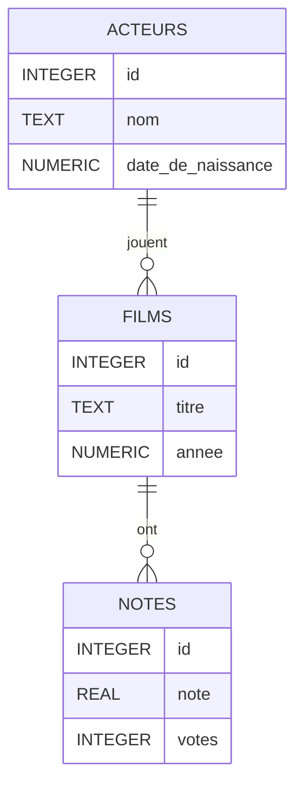

# [Cours 5](https://cs50.harvard.edu/sql/2024/notes/5/)

- [Introduction](#introduction)
- [Index](#index)
- [Index sur plusieurs tables](#index-sur-plusieurs-tables)
- [Compromis espace](#compromis-espace)
- [Compromis temps](#compromis-temps)
- [Index partiel](#index-partiel)
- [Vacuum](#vacuum)
- [Concurrence](#concurrence)
  - [Transactions](#transactions)
  - [Conditions de course](#conditions-de-course)
- [Fin](#fin)

## Introduction

- Cette semaine, nous allons apprendre à optimiser nos requêtes SQL, à la fois en termes de temps et d'espace. Nous apprendrons également à exécuter des requêtes simultanément.
- Nous ferons tout cela dans le contexte d'une nouvelle base de données — la base de données Internet Movies Database, ou IMDb comme elle est plus communément connue. Notre base de données SQLite est compilée à partir de la grande base de données en ligne de films que vous avez peut-être déjà vue sur imdb.com.
- Jetez un œil à ces statistiques pour vous faire une idée de la taille de cette base de données ! Elle contient beaucoup plus de données que toutes les autres bases de données avec lesquelles nous avons travaillé jusqu'à présent.


- Voici le diagramme ER détaillant les entités et leurs relations.




## Index

- Ouvrons cette base de données appelée `movies.db` dans SQLite.
- `.schema` nous montre les tables créées dans cette base de données. Pour implémenter la relation plusieurs-à-plusieurs entre les entités Person et Movie du diagramme ER, nous avons ici une table jointe appelée `stars` qui référence les colonnes ID des deux tables `people` et `movies` en tant que colonnes de clé étrangère !
- Pour jeter un œil à la table `movies`, nous pouvons sélectionner dans la table et limiter les résultats.

```sql
SELECT * FROM "movies" LIMIT 5;
```

- Pour trouver les informations concernant le film Cars, nous exécuterions la requête suivante.

```sql
SELECT * FROM "movies"
WHERE "title" = 'Cars';
```

- Supposons que nous voulons savoir combien de temps il a fallu pour exécuter cette requête. SQLite dispose d'une commande `.timer on` qui nous permet de chronométrer nos requêtes.
- En exécutant à nouveau la requête ci-dessus pour trouver Cars, nous pouvons voir trois mesures de temps différentes affichées avec les résultats.
- Le temps "réel" indique le temps du chronomètre, ou le temps entre l'exécution de la requête et l'obtention des résultats. C'est la mesure de temps sur laquelle nous allons nous concentrer. Le temps nécessaire pour exécuter cette requête pendant le cours était d'environ un dixième de seconde !
- Sous le capot, lorsque la requête pour trouver Cars a été exécutée, nous avons déclenché un scan de la table `movies` — c'est-à-dire que la table `movies` a été scannée de haut en bas, ligne par ligne, pour trouver toutes les lignes avec le titre Cars.
- Nous pouvons optimiser cette requête pour qu'elle soit plus efficace qu'un scan. De la même manière que les manuels scolaires ont souvent un index, les tables de bases de données peuvent également avoir un index. Un index, en termes de bases de données, est une structure utilisée pour accélérer la récupération des lignes d'une table.
- Nous pouvons utiliser la commande suivante pour créer un index pour la colonne `"title"` dans la table `movies`.

```sql
CREATE INDEX "title_index" ON "movies" ("title");
```

- Après avoir créé cet index, nous exécutons à nouveau la requête pour trouver le film intitulé Cars. Lors de cette exécution, le temps nécessaire est considérablement plus court (pendant le cours, presque huit fois plus rapide que la première exécution) !
- Dans l'exemple précédent, une fois l'index créé, nous avons simplement supposé que SQL l'utiliserait pour trouver un film. Cependant, nous pouvons également le voir explicitement en utilisant une commande SQLite `EXPLAIN QUERY PLAN` avant toute requête.
- Pour supprimer l'index que nous venons de créer, exécutez :

```sql
DROP INDEX "title_index";
```

- Après avoir supprimé l'index, l'exécution à nouveau de `EXPLAIN QUERY PLAN` avec la requête `SELECT` démontrera que le plan reviendrait à scanner toute la base de données.

### Questions

> Les bases de données n'ont-elles pas des algorithmes implicites pour optimiser la recherche ?

- Elles en ont, pour certaines colonnes. Dans SQLite et la plupart des autres systèmes de gestion de bases de données, si nous spécifions qu'une colonne est une clé primaire, un index sera automatiquement créé via lequel nous pouvons rechercher la clé primaire. Cependant, pour les colonnes régulières comme `"title"`, il n'y aurait pas d'optimisation automatique.

> Serait-il judicieux de créer un index différent pour chaque colonne au cas où nous en aurions besoin ?

- Bien que cela semble utile, il y a des compromis en termes d'espace et du temps nécessaire pour insérer ultérieurement des données dans des tables avec un index. Nous verrons cela plus en détail bientôt !

## Index sur plusieurs tables

- Nous exécuterions la requête suivante pour trouver tous les films dans lesquels Tom Hanks a joué.

```sql
SELECT "title" FROM "movies"
WHERE "id" IN (
    SELECT "movie_id" FROM "stars"
    WHERE "person_id" = (
        SELECT "id" FROM "people"
        WHERE "name" = 'Tom Hanks'
    )
);
```

- Pour comprendre quel type d'index pourrait aider à accélérer cette requête, nous pouvons exécuter `EXPLAIN QUERY PLAN` avant cette requête à nouveau. Cela nous montre que la requête nécessite deux scans — de `people` et `stars`. La table `movies` n'est pas scannée car nous recherchons `movies` par son ID, pour lequel un index est automatiquement créé par SQLite !
- Créons les deux index pour accélérer cette requête.

```sql
CREATE INDEX "person_index" ON "stars" ("person_id");
CREATE INDEX "name_index" ON "people" ("name");
```

- Maintenant, nous exécutons `EXPLAIN QUERY PLAN` avec la même requête imbriquée. Nous pouvons observer que :
  - tous les scans sont maintenant des recherches utilisant des index, ce qui est génial !
  - la recherche sur la table `people` utilise quelque chose appelé un `COVERING INDEX`.
- Un index couvrant signifie que toutes les informations nécessaires pour la requête peuvent être trouvées dans l'index lui-même. Au lieu de deux étapes :
  1. rechercher les informations pertinentes dans l'index,
  2. utiliser l'index pour rechercher ensuite dans la table, un index couvrant signifie que nous effectuons notre recherche en une seule étape (juste la première).
- Pour que notre recherche sur la table `stars` utilise également un index couvrant, nous pouvons ajouter `"movie_id"` à l'index que nous avons créé pour `stars`. Cela garantira que les informations recherchées (movie ID) et la valeur recherchée (person ID) soient toutes deux dans l'index.
- Tout d'abord, supprimons l'implémentation existante de notre index sur la table `stars`.

```sql
DROP INDEX "person_index";
```

- Ensuite, nous créons le nouvel index.

```sql
CREATE INDEX "person_index" ON "stars" ("person_id", "movie_id");
```

- L'exécution de ce qui suit démontrera que nous avons maintenant deux index couvrants, ce qui devrait résulter en une recherche beaucoup plus rapide !

```sql
EXPLAIN QUERY PLAN
SELECT "title" FROM "movies" WHERE "id" IN (
    SELECT "movie_id" FROM "stars" WHERE "person_id" = (
        SELECT "id" FROM "people" WHERE "name" = 'Tom Hanks'
    )
);
```

- En nous assurant que nous avons exécuté `.timer on`, exécutons la requête ci-dessus pour trouver tous les films dans lesquels Tom Hanks a joué, et observons le temps qu'il faut pour l'exécuter. La requête s'exécute maintenant beaucoup plus rapidement qu'elle ne le faisait sans index (dans le cours, un ordre de grandeur plus rapide) !

## Compromis espace

- Les index semblent incroyablement utiles, mais il y a des compromis associés — ils occupent un espace supplémentaire dans la base de données, donc même si nous gagnons en vitesse de requête, nous perdons en espace.
- Un index est stocké dans une base de données sous la forme d'une structure de données appelée B-Tree, ou arbre équilibré. Une structure de données d'arbre ressemble à ceci :


- Remarquez que l'arbre a de nombreux nœuds, chacun connecté à quelques autres par des flèches. Le nœud racine, ou le nœud à partir duquel l'arbre prend son origine, a trois enfants. Certains nœuds à la périphérie de l'arbre ne pointent vers aucun autre nœud. Ceux-ci sont appelés nœuds feuilles.
- Considérons comment un index est créé pour la colonne `"title"` de la table `movies`. Si les titres des films étaient triés par ordre alphabétique, il serait beaucoup plus facile de trouver un film particulier en utilisant une recherche binaire.
- Dans ce cas, une copie est faite de la colonne `"titles"`. Cette copie est triée puis liée à nouveau aux lignes d'origine dans la table `movies` en pointant vers les ID des films. Cela est visualisé ci-dessous.


- Bien que cela nous aide à visualiser facilement l'index pour cette colonne, en réalité, l'index n'est pas une seule colonne mais est divisé en de nombreux nœuds. C'est parce que si la base de données contient beaucoup de données, comme notre exemple IMDb, stocker une colonne entière ensemble en mémoire pourrait ne pas être faisable.
- Si nous avons plusieurs nœuds contenant des sections de l'index, nous avons également besoin de nœuds pour naviguer vers les bonnes sections. Par exemple, considérez les nœuds suivants. Le nœud de gauche nous dirige vers la bonne section de l'index en fonction du fait que le titre du film vient avant Frozen, entre Frozen et Soul, ou après Soul par ordre alphabétique !


- La représentation ci-dessus est un B-tree ! C'est ainsi que les index sont stockés dans SQLite.

## Compromis temps

- De manière similaire au compromis espace dont nous avons discuté précédemment, il faut également plus de temps pour insérer des données dans une colonne et ensuite les ajouter à un index. Chaque fois qu'une valeur est ajoutée à l'index, le B-tree doit être parcouru pour déterminer où la valeur doit être ajoutée !

## Index partiel

- Il s'agit d'un index qui n'inclut qu'un sous-ensemble de lignes d'une table, nous permettant d'économiser un peu de l'espace qu'un index complet occuperait.
- Cela est particulièrement utile lorsque nous savons que les utilisateurs n'interrogent qu'un sous-ensemble de lignes de la table. Dans le cas d'IMDb, il se peut que les utilisateurs soient plus susceptibles d'interroger un film qui vient de sortir plutôt qu'un film vieux de 15 ans. Essayons de créer un index partiel qui stocke les titres des films sortis en 2023.

```sql
CREATE INDEX "recents" ON "movies" ("titles")
WHERE "year" = 2023;
```

- Nous pouvons vérifier que la recherche de films sortis en 2023 utilise le nouvel index.

```sql
EXPLAIN QUERY PLAN
SELECT "title" FROM "movies"
WHERE "year" = 2023;
```

Cela nous montre que la table `movies` est scannée en utilisant l'index partiel.

### Questions

> Les index sont-ils sauvegardés dans le schéma ?

- Oui, dans SQLite, ils le sont ! Nous pouvons le confirmer en exécutant `.schema` et nous verrons les index créés listés dans le schéma de la base de données.

## Vacuum

- Il existe des moyens de supprimer l'espace inutilisé dans notre base de données. SQLite nous permet de "vacuumiser" les données — cela nettoie les données précédemment supprimées (qui ne sont en fait pas supprimées, mais simplement marquées comme espace disponible pour la prochaine `INSERT`).
- Pour trouver la taille de `movies.db` sur le terminal, nous pouvons utiliser une commande Unix

```bash
du -b movies.db
```

- Dans le cours, cette commande nous a montré que la taille de la base de données est d'environ 158 millions d'octets, soit 158 mégaoctets.
- Nous pouvons maintenant nous connecter à notre base de données et supprimer un index que nous avions précédemment créé.

```sql
DROP INDEX "person_index";
```

- Maintenant, si nous exécutons à nouveau la commande Unix, nous constatons que la taille de la base de données n'a pas diminué ! Pour réellement nettoyer l'espace supprimé, nous devons le vacuumiser. Nous pouvons exécuter la commande suivante dans SQLite.

```sql
VACUUM;
```

Cela peut prendre une seconde ou deux pour s'exécuter. En exécutant à nouveau la commande Unix pour vérifier la taille de la base de données, nous devrions voir une taille plus petite. Une fois que nous avons supprimé tous les index et vacuumisé à nouveau, la base de données sera considérablement plus petite que 158 Mo (dans le cours, environ 100 Mo).

### Questions

> Est-il possible de vacuumiser plus rapidement ?

- Chaque vacuumisation peut prendre une quantité de temps différente, en fonction de la quantité d'espace que nous essayons de vacuumiser et de la facilité avec laquelle nous pouvons trouver les bits et les octets qui doivent être libérés !

> Si une requête pour supprimer certaines lignes ne les supprime pas réellement, mais les marque seulement comme supprimées, pourrions-nous toujours récupérer ces lignes ?

- Les personnes formées à la médecine légale sont capables de trouver des données que nous pensons supprimées mais qui sont en fait toujours sur nos ordinateurs. Dans le cas de SQLite, après avoir effectué un vacuum, il ne serait plus possible de retrouver les lignes supprimées.

## Concurrence

- Jusqu'à présent, nous avons vu comment optimiser des requêtes individuelles. Maintenant, nous allons voir comment permettre non seulement une requête, mais plusieurs à la fois.
- La concurrence est la gestion simultanée de plusieurs requêtes ou interactions par la base de données. Imaginez une base de données pour un site web, ou un service financier, qui reçoit beaucoup de trafic en même temps. La concurrence est particulièrement importante dans ces cas.
- Certaines transactions de base de données peuvent être multipartites. Par exemple, considérons la base de données d'une banque. Voici une vue de la table `accounts` qui stocke les soldes des comptes.


- Une transaction pourrait consister à envoyer de l'argent d'un compte à un autre. Par exemple, Alice essaie d'envoyer 10 $ à Bob.
- Pour compléter cette transaction, nous devrions ajouter 10 $ au compte de Bob et également soustraire 10 $ du compte d'Alice. Si quelqu'un voit l'état de la base de données `accounts` après la première mise à jour du compte de Bob mais avant la deuxième mise à jour du compte d'Alice, il pourrait obtenir une compréhension incorrecte du montant total d'argent détenu par la banque.

### Transactions

- Pour un observateur extérieur, il devrait sembler que les différentes parties d'une transaction se produisent toutes en même temps. En termes de bases de données, une transaction est une unité individuelle de travail — quelque chose qui ne peut pas être décomposé en morceaux plus petits.
- Les transactions ont certaines propriétés, qui peuvent être rappelées en utilisant l'acronyme ACID :
  - atomicité : ne peut pas être décomposée en morceaux plus petits,
  - cohérence : ne doit pas violer une contrainte de base de données,
  - isolation : si plusieurs utilisateurs accèdent à une base de données, leurs transactions ne peuvent pas interférer les unes avec les autres,
  - durabilité : en cas de défaillance dans la base de données, toutes les données modifiées par les transactions resteront.
- Ouvrons `bank.db` dans notre terminal afin que nous puissions implémenter une transaction pour transférer de l'argent d'Alice à Bob !
- Tout d'abord, nous voulons voir les données déjà présentes dans la table `accounts`.

```sql
SELECT * FROM "accounts";
```

Nous notons ici que l'ID de Bob est 2 et celui d'Alice est 1, ce qui sera utile pour notre requête.
- Pour transférer 10 $ du compte d'Alice à celui de Bob, nous pouvons écrire la transaction suivante.

```sql
BEGIN TRANSACTION;
UPDATE "accounts" SET "balance" = "balance" + 10 WHERE "id" = 2;
UPDATE "accounts" SET "balance" = "balance" - 10 WHERE "id" = 1;
COMMIT;
```

Remarquez que les instructions `UPDATE` sont écrites entre les commandes pour commencer la transaction et la valider. Si nous exécutons la requête après avoir écrit les instructions `UPDATE`, mais sans les valider, aucune des deux instructions `UPDATE` ne sera exécutée ! Cela aide à garder la transaction atomique. En mettant à jour notre table de cette manière, nous ne pouvons pas voir les étapes intermédiaires.
- Si nous essayions d'exécuter à nouveau la transaction ci-dessus — Alice essaie de payer Bob encore 10 $ — elle devrait échouer car le solde du compte d'Alice est à 0. (La colonne `"balance"` dans `accounts` a une contrainte de vérification pour s'assurer qu'elle a une valeur non négative. Nous pouvons exécuter `.schema` pour vérifier cela.)
- La manière dont nous implémentons l'annulation de la transaction est en utilisant `ROLLBACK`. Une fois que nous avons commencé une transaction et écrit quelques instructions SQL, si l'une d'elles échoue, nous pouvons la terminer avec un `ROLLBACK` pour revenir toutes les valeurs à leur état pré-transaction. Cela aide à garder les transactions cohérentes.

```sql
BEGIN TRANSACTION;
UPDATE "accounts" SET "balance" = "balance" + 10 WHERE "id" = 2;
UPDATE "accounts" SET "balance" = "balance" - 10 WHERE "id" = 1; -- Invokes constraint error
ROLLBACK;
```

### Conditions de course

- Les transactions peuvent aider à se prémunir contre les conditions de course.
- Une condition de course se produit lorsque plusieurs entités accèdent simultanément à une valeur partagée et prennent des décisions basées sur celle-ci, potentiellement causant des incohérences dans la base de données. Des conditions de course non résolues peuvent être exploitées par des hackers pour manipuler la base de données.
- Dans le cours, un exemple de condition de course est discuté dans lequel deux utilisateurs travaillant ensemble peuvent exploiter des incohérences momentanées dans la base de données pour voler la banque.
- Cependant, les transactions sont traitées en isolation pour éviter les incohérences dès le départ. Chaque transaction traitant des données similaires de notre base de données sera traitée séquentiellement. Cela aide à prévenir les incohérences qu'une attaque adversariale pourrait exploiter.
- Pour rendre les transactions séquentielles, SQLite et d'autres systèmes de gestion de bases de données utilisent des verrous sur les bases de données. Une table dans une base de données pourrait être dans quelques états différents :
  - UNLOCKED : c'est l'état par défaut lorsqu'aucun utilisateur n'accède à la base de données,
  - SHARED : lorsqu'une transaction lit des données de la base de données, elle obtient un verrou partagé qui permet à d'autres transactions de lire simultanément de la base de données,
  - EXCLUSIVE : si une transaction doit écrire ou mettre à jour des données, elle obtient un verrou exclusif sur la base de données qui ne permet pas à d'autres transactions de se produire en même temps (pas même une lecture).

### Questions

> Comment décidons-nous quand une transaction peut obtenir un verrou exclusif ? Comment priorisons-nous différents types de transactions ?

- Différents algorithmes pourraient être utilisés pour prendre ces décisions. Par exemple, nous pourrions toujours choisir la transaction qui est arrivée en premier. Si une transaction exclusive est nécessaire, aucune autre transaction ne peut s'exécuter en même temps, ce qui est un inconvénient nécessaire pour assurer la cohérence de la table.

> Quelle est la granularité du verrouillage ? Verrouillons-nous une base de données, une table ou une ligne d'une table ?

- Cela dépend du SGBD. Dans SQLite, nous pouvons le faire en exécutant une transaction exclusive comme suit :

```sql
BEGIN EXCLUSIVE TRANSACTION;
```

Si nous ne complétons pas cette transaction maintenant, et essayons de nous connecter à la base de données via un autre terminal pour lire depuis la table, nous obtiendrons une erreur indiquant que la base de données est verrouillée ! Cela, bien sûr, est une manière très grossière de verrouiller car elle verrouille toute la base de données. Comme SQLite est grossier de cette manière, il a un module pour prioriser les transactions et s'assurer qu'un verrou exclusif est obtenu uniquement pour la durée la plus courte nécessaire.

## Fin

- Cela conclut le Cours 5 sur l'Optimisation en SQL !