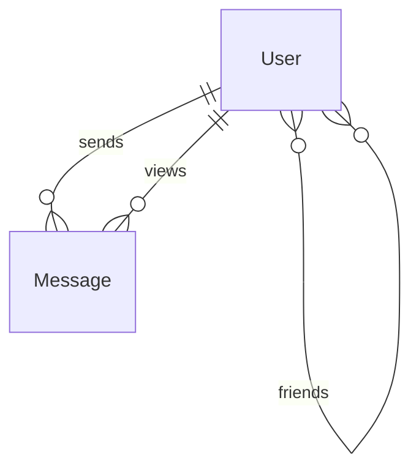

# [En un Clin d'Œil](https://cs50.harvard.edu/sql/2024/psets/5/snap/)

 « Peinture à l'huile abstraite d'une image numérique envoyée depuis un téléphone », générée par DALL·E 2

## Problème à Résoudre

Après la presse à imprimer, le service postal et le télégramme, sont arrivées les applications de messagerie. Il y a de fortes chances que vous ayez utilisé une application de messagerie aujourd'hui, qu'il s'agisse de Facebook Messenger, iMessage, Instagram, Signal ou Snapchat, parmi tant d'autres. Alors que leurs prédécesseurs mesuraient la vitesse de communication en termes de semaines, jours ou heures, les applications de messagerie dépendent d'une vitesse de l'ordre des millisecondes : un message retardé est maintenant une connexion manquée.

Dans ce problème, vous écrirez des requêtes SQL pour une application fictive qui permet aux utilisateurs d'envoyer des photos qui expirent 30 secondes après que le destinataire les a vues (une idée popularisée par Snapchat !). Les requêtes que vous écrirez permettront finalement à l'application de mettre en œuvre ses fonctionnalités principales. Cependant, étant donné que l'application compte plusieurs milliers d'utilisateurs dépendant d'une communication instantanée, il est particulièrement important d'écrire des requêtes rapides, et pas seulement correctes. Vous pratiquerez l'écriture de requêtes qui tirent parti des index, tout cela au service de permettre aux utilisateurs de rester en contact en un clin d'œil.

## Démonstration

```bash
$ sqlite3 snap.db                                                                                   
sqlite> EXPLAIN QUERY PLAN SELECT * FROM "messages" WHERE "from_user_id" = 2;                                                                   
QUERY PLAN                                                                                          
--SEARCH messages USING INDEX search_messages_by_from_user_id (from_user_id=?)                     
sqlite> .quit 
```

## Code de Distribution

Pour ce problème, vous devrez utiliser `snap.db` et quelques fichiers `.sql` dans lesquels vous écrirez vos instructions SQL.


## Schéma



Dans `snap.db`, vous trouverez trois tables qui implémentent les relations décrites dans le diagramme ER ci-dessus. Cliquez sur les menus déroulants ci-dessous pour en savoir plus sur le schéma de chaque table individuelle.

### Table `users`

La table `users` contient les colonnes suivantes :

- `id`, qui est l'ID de l'utilisateur.
- `username`, qui est le nom d'utilisateur de l'utilisateur.
- `phone_number`, qui est le numéro de téléphone de l'utilisateur.
- `joined_date`, qui est la date à laquelle l'utilisateur a rejoint l'application.
- `last_login_date`, qui est la date à laquelle l'utilisateur s'est connecté pour la dernière fois.

### Table `friends`

La table `friends` contient les colonnes suivantes :

- `user_id`, qui est l'ID d'un utilisateur donné.
- `friend_id`, qui est l'ID de l'utilisateur avec lequel l'utilisateur donné est ami.
- `friendship_date`, qui est la date à laquelle l'amitié a commencé.

Pour chaque ligne, l'utilisateur dans la colonne `user_id` compte l'utilisateur dans la colonne `friend_id` parmi ses amis, mais pas nécessairement vice versa. Lorsque deux utilisateurs se comptent mutuellement parmi leurs amis, deux lignes sont insérées :

| user_id | friend_id | friendship_date |
| ------- | --------- | --------------- |
| 1       | 2         | 2024-01-01      |
| 2       | 1         | 2024-01-01      |

### Table `messages`

La table `messages` contient les colonnes suivantes :

- `id`, qui est l'ID du message.
- `from_user_id`, qui est l'ID de l'utilisateur qui a envoyé le message.
- `to_user_id`, qui est l'ID de l'utilisateur auquel le message a été envoyé.
- `picture`, qui est le nom de fichier de la photo qui a été envoyée dans le message.
- `sent_timestamp`, qui est l'horodatage auquel le message a été envoyé.
- `viewed_timestamp`, qui est l'horodatage auquel le message a été vu.
- `expires_timestamp`, qui est l'horodatage auquel le message expire.

## Spécification

Dans chaque fichier `.sql` correspondant, écrivez une requête SQL pour implémenter les fonctionnalités décrites ci-dessous. Puisque la vitesse est essentielle, vous devrez également vous assurer que votre requête utilise l'index spécifié. La meilleure façon de s'assurer qu'une requête utilise un index est de vérifier les résultats de `EXPLAIN QUERY PLAN`.

Si vous vous sentez incertain sur la façon d'interpréter la sortie de `EXPLAIN QUERY PLAN`, consultez la section Conseils pour des explications supplémentaires !

### `1.sql`

L'équipe d'engagement des utilisateurs de l'application doit identifier les utilisateurs actifs. Trouvez tous les noms d'utilisateur des utilisateurs qui se sont connectés depuis le 2024-01-01. Assurez-vous que votre requête utilise l'index `search_users_by_last_login`, qui est défini comme suit :

```
CREATE INDEX "search_users_by_last_login"
ON "users"("last_login_date");
```

### `2.sql`

Les utilisateurs doivent être empêchés de rouvrir un message qui a expiré. Trouvez quand le message avec l'ID 151 expire. Vous pouvez utiliser l'ID du message directement dans votre requête.

Assurez-vous que votre requête utilise l'index créé automatiquement sur la colonne de clé primaire de la table `messages`.

### `3.sql`

L'application doit classer les « meilleurs amis » d'un utilisateur, similaire à la fonctionnalité « Friend Emojis » de Snapchat. Trouvez les ID des trois principaux utilisateurs auxquels `creativewisdom377` envoie le plus fréquemment des messages. Classez les ID des utilisateurs par le nombre de messages que `creativewisdom377` a envoyés à ces utilisateurs, du plus grand au plus petit.

Assurez-vous que votre requête utilise l'index `search_messages_by_from_user_id`, qui est défini comme suit :

```
CREATE INDEX "search_messages_by_from_user_id"
ON "messages"("from_user_id");
```

### `4.sql`

L'application doit envoyer aux utilisateurs un résumé de leur engagement. Trouvez le nom d'utilisateur de l'utilisateur le plus populaire, défini comme l'utilisateur à qui le plus de messages ont été envoyés.

Assurez-vous que votre requête utilise l'index `search_messages_by_to_user_id`, qui est défini comme suit :

```
CREATE INDEX "search_messages_by_to_user_id"
ON "messages"("to_user_id");
```

### `5.sql`

Pour deux utilisateurs quelconques, l'application doit rapidement afficher une liste des amis qu'ils ont en commun. Étant donné deux noms d'utilisateur, `lovelytrust487` et `exceptionalinspiration482`, trouvez les ID des amis communs. Un ami commun est un utilisateur que `lovelytrust487` et `exceptionalinspiration482` comptent tous deux parmi leurs amis.

Assurez-vous que votre requête utilise l'index créé automatiquement sur les colonnes de clé primaire de la table `friends`. Cet index s'appelle `sqlite_autoindex_friends_1`.

Besoin d'un indice ?

Rappelez-vous qu'en SQL, vous pouvez utiliser certains mots-clés pour trouver l'intersection de deux groupes. Consultez les notes de la semaine 1 pour un rappel.

## Conseils

### Utiliser `EXPLAIN QUERY PLAN` pour montrer les étapes d'une requête

Pour vérifier les résultats de `EXPLAIN QUERY PLAN`, vous devez simplement préfixer `EXPLAIN QUERY PLAN` à votre requête :

```
EXPLAIN QUERY PLAN
SELECT "username"
FROM "users"
WHERE "id" = 151;
```

### Interpréter les résultats de `EXPLAIN QUERY PLAN`

Rappelez-vous du cours que `EXPLAIN QUERY PLAN` affiche les étapes que le moteur de base de données SQLite va suivre pour exécuter une requête SQL donnée. La sortie de `EXPLAIN QUERY PLAN` peut indiquer si une requête utilise un index.

- Si vous voyez une étape étiquetée `USING INDEX`, cela signifie que la requête utilise un index à cette étape.
- Si vous voyez une étape étiquetée `USING COVERING INDEX`, cela indique que la requête utilise un index couvrant à cette étape.
    - Rappelez-vous qu'un index couvrant est un type spécial d'index qui inclut toutes les colonnes nécessaires pour la requête. Cela signifie que la base de données peut satisfaire la requête directement à partir de l'index sans avoir à rechercher des données supplémentaires dans une table.
- Lorsque vous voyez une étape étiquetée `USING INTEGER PRIMARY KEY`, cela implique que la requête utilise l'index sur la colonne de clé primaire, qui est fourni automatiquement par SQLite lorsque la clé primaire est de type affinité `INTEGER`. C'est un moyen efficace d'accéder directement aux lignes si les conditions de la requête impliquent la clé primaire d'une table.

Voici quelques exemples de résultats de `EXPLAIN QUERY PLAN`, issus de requêtes qui utilisent un index dans au moins une étape de leur exécution :

##### Exemple 1

```
QUERY PLAN
`--SEARCH users USING INDEX search_users_by_last_login (last_login_date>?
```

Remarquez que cette requête peut être exécutée en une seule étape, en recherchant l'index `search_users_by_last_login`.

##### Exemple 2

```
QUERY PLAN
|--SEARCH messages USING COVERING INDEX search_messages_by_to_user_id (to_user_id=?
`--SCALAR SUBQUERY 1
   `--SEARCH users USING COVERING INDEX sqlite_autoindex_users_1 (username=?
```

Remarquez que cette requête nécessite deux étapes :

1. La première recherche l'index `search_messages_by_to_user_id`.
2. La seconde résout une sous-requête en recherchant l'index `sqlite_autoindex_users_1`.

##### Exemple 3

```
QUERY PLAN
|--SEARCH messages USING INDEX search_messages_by_from_user_id (from_user_id=?
|--SCALAR SUBQUERY 1
|  `--SEARCH users USING COVERING INDEX sqlite_autoindex_users_1 (username=?
|--USE TEMP B-TREE FOR GROUP BY
`--USE TEMP B-TREE FOR ORDER BY
```

Remarquez que cette requête implique plusieurs étapes, et qu'elle utilise des index pour accomplir la plupart :

1. La première étape recherche l'index `search_messages_by_from_user_id`.
2. La deuxième étape recherche l'index `sqlite_autoindex_users_1`.
3. Les étapes finales utilisent des B-trees temporaires pour grouper et ordonner les résultats.

##### Exemple 4

```
QUERY PLAN
|--SEARCH users USING INTEGER PRIMARY KEY (rowid=?
`--SCALAR SUBQUERY 1
   |--SCAN messages USING COVERING INDEX search_messages_by_to_user_id
   `--USE TEMP B-TREE FOR ORDER BY
```

Remarquez que cette requête implique plusieurs étapes, et qu'elle utilise des index pour accomplir la plupart :

1. La première étape recherche un index de clé primaire automatique.
2. La deuxième étape scanne les lignes en utilisant l'index `search_messages_by_to_user_id`.
3. L'étape finale utilise un B-tree temporaire pour ordonner les résultats.

##### Exemple 5

```
QUERY PLAN
`--COMPOUND QUERY
   |--LEFT-MOST SUBQUERY
   |  |--SEARCH friends USING COVERING INDEX sqlite_autoindex_friends_1 (user_id=?
   |  `--SCALAR SUBQUERY 1
   |     `--SEARCH users USING COVERING INDEX sqlite_autoindex_users_1 (username=?
   `--INTERSECT USING TEMP B-TREE
      |--SEARCH friends USING COVERING INDEX sqlite_autoindex_friends_1 (user_id=?
      `--SCALAR SUBQUERY 3
         `--SEARCH users USING COVERING INDEX sqlite_autoindex_users_1 (username=?
```

Remarquez que cette requête implique de nombreuses étapes, et qu'elle utilise des index pour accomplir la plupart. Voyez en particulier que l'index `sqlite_autoindex_friends_1` est fréquemment accédé.

